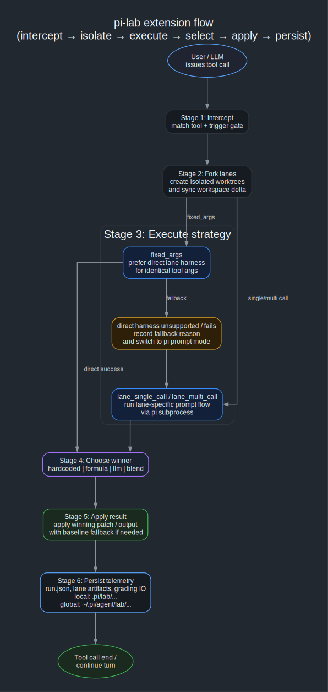

# pi-lab

`pi-lab` lets you run multiple **extension-backed lanes** behind a single tool call, compare them in isolation, and continue with one selected result.

> ⚠️ **Warning**
> `pi-lab` is still an **experimental alpha**. Config shape, telemetry shape, and runtime behavior may still change before `v1`.

> **Note**
> If `pi-lab` is useful to you, I'd be grateful for feedback, code, docs help, or GitHub Sponsors: <https://github.com/sponsors/marckrenn>

## Use it when you want to

- compare permutations of a tool or extension
- try alternative extension-backed lane bundles with different prompts, tools, or behavior
- let a formula, an LLM, or both choose which lane to proceed with
- keep a safe fallback lane while still collecting telemetry from alternatives

## What it does

A typical run looks like this:
1. intercept a matching tool call
2. fork isolated lane workspaces
3. execute lanes with the configured strategy
4. choose a winner
5. apply the selected result
6. persist telemetry and artifacts



- [Open the flowchart directly](docs/pi-lab-extension-flow.svg)
- [Architecture details](docs/architecture.md)
- [Execution strategies](docs/strategies.md)

## Install

The current install path is **git-first preview**.

```bash
pi install git:github.com/marckrenn/pi-lab
```

For local repo development:

```bash
cd /path/to/pi-lab
pi -e ./pi-extension/lab/index.ts
```

## Set up your first experiment

The easiest path is:
1. install `pi-lab`
2. open your project in pi
3. run `/lab create`
4. let pi-lab collect the setup details and inject them into the conversation

What the clanker should usually do:
- inspect the target tool or workflow before choosing `fixed_args`, `lane_single_call`, or `lane_multi_call`
- create project-local experiment config in `.pi/lab/experiments/*.json`
- create or wire lane files and prompts as needed
- keep one lane as the baseline/fallback lane
- tell you how to run and inspect the experiment

If you want examples after that:
- [Config examples](docs/config-examples.md)
- [Strategies](docs/strategies.md)

## Git requirement

Normal multi-lane execution uses **git worktrees**.

That means:
- inside a git repo, lanes run in isolation
- outside a git repo, `pi-lab` falls back to the baseline lane only
- fallback reasons are written to telemetry so the behavior is visible

## `/lab`

`/lab` is the built-in control surface for pi-lab.

- `/lab` opens the interactive menu
- `/lab create` injects an experiment-setup kickoff into the normal conversation
- the menu has **Experiments**, **Runs**, and **Maintenance**
- text commands like `/lab experiments`, `/lab runs`, `/lab status`, `/lab validate`, and `/lab gc ...` also work

More details:
- [Troubleshooting and operations](docs/troubleshooting.md)

## Where config lives

Experiment configs are defined as JSON.

Locations:
- **project-local**: `.pi/lab/experiments/*.json`
- **global**: `~/.pi/agent/lab/experiments/*.json`

If the same experiment id exists in multiple places, project-local config wins.

## Where runs and artifacts live

`pi-lab` now supports both local and global run storage.

### Local project data
- run directories: `.pi/lab/<run-id>/`
- aggregate log: `.pi/lab/runs.jsonl`

### Global data
- run directories: `~/.pi/agent/lab/<project>/<run-id>/`
- aggregate log: `~/.pi/agent/lab/<project>/runs.jsonl`

More details:
- [Telemetry layout](docs/telemetry.md)

## Read more

- [Architecture](docs/architecture.md)
- [Strategies](docs/strategies.md)
- [Config examples](docs/config-examples.md)
- [Telemetry](docs/telemetry.md)
- [Troubleshooting](docs/troubleshooting.md)
- [Contributing / development](docs/contributing.md)
